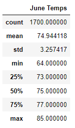
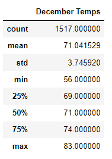

# Surfs_Up
Advanced data storage. Using jupyter notebook, vs code, sqlLite, flask

## Overview of the Analysis
### Purpose
The client, W. Avy wants to open a surf and ice cream shop in Oahu, Hawaii. The purpose of this analysis is to help W. Avy explore weather statistics and temperature trends throughout the year to determine whether a surf and ice cream shop would be suitable for year-round business. To help him determine this, W. Avy is looking for the temperature data for the months of June and December.

### Resources
Data: 

## Results

### June Temperature Summary Statistics 

In June, the temperatures ranged from 64°F to 85°F. The average temperature is 75°F. Fifty percent the month it is 75°F or hotter.  

### December Temperature Summary Statistics

In December, the temperatures ranged from 56°F to 83°F. The average temperature is 71°F. Fifty percent the month is 71°F or hotter.

## Summary

Average temperatures on Oahu during June and December were 75°F and 71°F respectively. The max temperatures for each month were relatively the similar, only a difference of two degrees. However, there is a greater difference between the minimum temperatures of each month. There is an eight-degree difference between the minimum temperature of June and the minimum in December. This means that the weather data in December has more of a negative or left skew. Also, there is a higher standard deviation in December meaning there are stronger fluctuations in the temperature during December. 
Based on the temperature analysis, there does not seem to be enough of a drastic difference between the summer months and winter months to deter W. Avy from pursuing their dream of opening a ice cream surf shop. Even in December, 75% of the month is 69°F or more. If W. Avy wishes to further explore weather data, it would be useful to look at other weather-related events that may affect surfers and the resulting board rentals. Monthly precipitation, wind speeds, and ocean conditions such as wave size are examples of weather conditions that could affect surfers. Doing further analysis on these conditions may be beneficial for W. Avy to make their determination.
